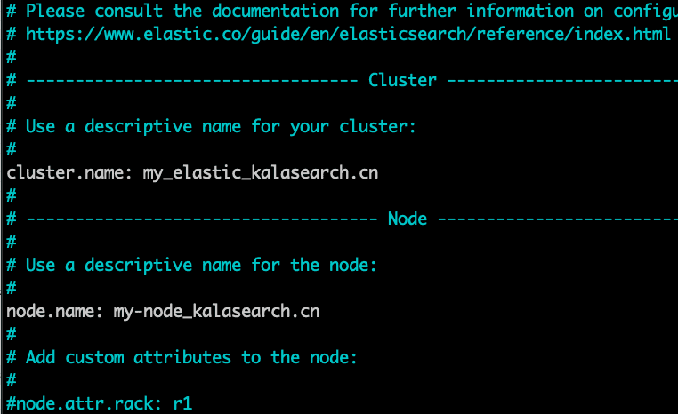
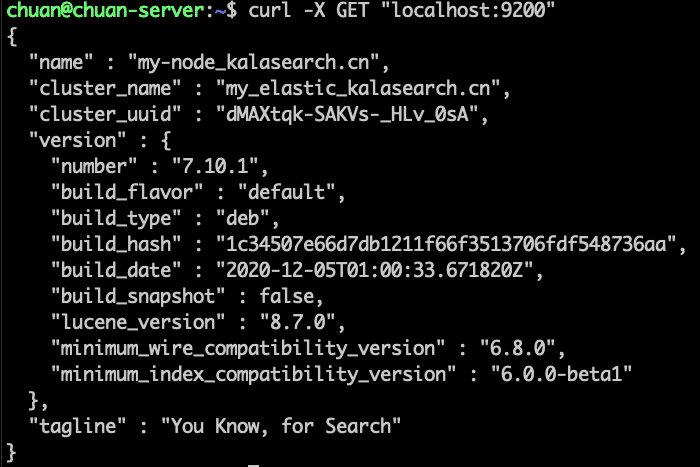

### 前言

ElasticSearch 及配套可视化 Web 界面 Kibana 是搭建站内搜索的基础配置，在本教程中，我们在 Ubuntu 20.04 服务器上安装 ElasticSearch 及 Kibana 。由于 Kibana 仅在 `localhost` 上可用，我们还会使用 [Nginx](https://www.nginx.com/) 进行代理，以便可以通过 Web 浏览器远程访问。

Elastic 主要组件：

- **[ElasticSearch](https://www.elastic.co/products/elasticsearch)**：分布式 [RESTful](https://en.wikipedia.org/wiki/Representational_state_transfer) 搜索引擎，用于存储所有收集的数据。
- **[Kibana](https://www.elastic.co/products/kibana)**：用于搜索和可视化日志的Web界面。

### 第 1 步 - 安装和配置 ElasticSearch

直接下载安装我们可以在 Elastic 的[官网](https://www.elastic.co/cn/downloads/elasticsearch)找到最新版的下载地址。然后使用 `wget` 下载。

```bash
wget https://artifacts.elastic.co/downloads/elasticsearch/elasticsearch-7.10.1-amd64.deb
```

使用 `dpkg` 进行本地安装

```bash
sudo dpkg -i elasticsearch-7.10.1-amd64.deb
```

安装完成后，我们对 ElasticSearch 进行配置。这里很关键，如果不配置，ES 运行时会报错。

大家可使用自己趁手的编辑器打开 `elasticsearch.yml` 文件。本教程使用 `nano` 编辑器：

```bash
sudo nano /etc/elasticsearch/elasticsearch.yml
```

**注意：** ElasticSearch 的配置文件为 YAML 格式，请注意缩进。

有关 ElasticSearch 群集，节点，路径，内存，网络，网关的配置选项都在这个配置文件中配置。大多数选项，我们可以直接使用默认选项，但有两个选项非常基础，必须配置 ES 才可以在我们的机器上跑起来。



```bash
sudo systemctl start elasticsearch
```

我们用 http 请求来测试一下 ES 服务是否启动。

```bash
curl -X GET "localhost:9200"
```



### 第 2 步 - 安装和配置 Kibana

根据[官方文档](https://www.elastic.co/guide/en/elastic-stack/current/installing-elastic-stack.html)，我们应该在安装 ES 之后来安装 Kibana ，注意安装顺序，以避免不必要的麻烦。

同es一样直接从官网下载跟es一样版本的kibana进行安装。

首先我们使用 `openssl` 命令创建一个管理 Kibana 的用户， 我们使用这个账户来访问 Kibana Web 。本教程使用 `KalasearchAdmin` 作为用户名。

我们使用以下命令来给 Kibana 创建管理用户名和密码，这些用户名和密码会存储在 `htpasswd.users` 文件中。

```bash
echo "KalasearchAdmin:`openssl passwd -apr1`" | sudo tee -a /etc/nginx/htpasswd.users
```

在提示符里输入并确认密码。请牢记此登录名及密码，我们接下来使用浏览器访问 Kibana Web 页面时会用到。

接着，我们来创建一个 Nignx Server block 文件。本教程的 Ubuntu 服务器跑在虚拟机上，所以我使用虚拟机的 IP 地址来创建，你们可以绑定自己的域名，如果使用虚拟机，也可以像我一样使用虚拟机的 IP 地址。如果使用域名，记得修改域名 DNS 记录指向自己的服务器。

```bash
sudo nano /etc/nginx/sites-available/192.168.180.134（替换成你的域名）
```

我已经帮大家写好了路由代码，直接复制粘贴即可。注意：请将 `server_name` 后面的 IP 地址 替换成你服务器的 IP 或域名。此代码中，Nginx 会把接入服务器的请求重新定向至 Kibana 即 `localhost:5601` ，另外，这段代码也会读取 `htpasswd.users` 文件并进行身份验证。

```bash
server {
    listen 80;

    server_name 192.168.180.134（替换成你的域名）;

    auth_basic "Restricted Access";
    auth_basic_user_file /etc/nginx/htpasswd.users;

    location / {
        proxy_pass http://localhost:5601;
        proxy_http_version 1.1;
        proxy_set_header Upgrade $http_upgrade;
        proxy_set_header Connection 'upgrade';
        proxy_set_header Host $host;
        proxy_cache_bypass $http_upgrade;
    }
}
```

完成后，保存并关闭。

接着，我们来创建 `sites-enabled` 目录来启动新配置。

```bash
sudo ln -s /etc/nginx/sites-available/（替换成你的域名） /etc/nginx/sites-enabled/（替换成你的域名）
```

然后我们来检查一下配置的语法是否有错。

```bash
sudo nginx -t
```

如果报错，请返回并再次检查。如果正确会看到以上成功信息。

让我们来重启 Nginx 服务：

```bash
sudo systemctl reload nginx
```

接着我们让服务器防火墙允许我们的 Nginx 通过：

```bash
sudo ufw allow 'Nginx Full'
```

打开你的浏览器，访问刚刚设置的 IP 或域名：

```bash
http://（替换成你的域名）/status
```